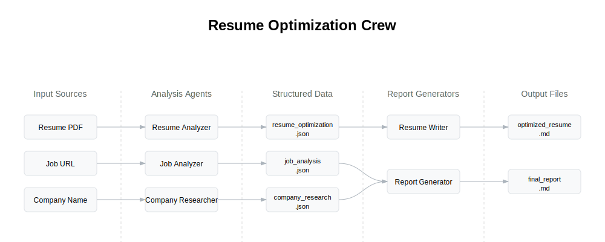

# Resume Optimization System Architecture

This document provides an overview of the resume optimization system architecture.

## System Components

### 1. Input Sources

- Resume (PDF format)
- Job URL
- Company Name

### 2. Analysis Agents

- **Job Analyzer**: Uses ScrapeWebsiteTool to analyze job descriptions
- **Resume Analyzer**: Uses PDFKnowledgeSource to analyze resumes
- **Company Researcher**: Uses SerperDevTool for company research

### 3. Structured Data

JSON files storing analysis results:

- job_analysis.json
- resume_optimization.json
- company_research.json

### 4. Report Generators

- **Resume Writer**: Creates optimized resumes
- **Report Generator**: Creates comprehensive reports

### 5. Output Files

Markdown files:

- optimized_resume.md
- final_report.md

